# pg_lake + Iceberg 小白入门调研 Wiki

> 目标读者：没有数据库背景，但需要理解 pg_lake、Iceberg、DuckDB、对象存储和 GaussDB 评估方向的人。
>
> 生成时间：2026-06-26。事实依据来自 `results/*.json` 的本地深度调研、pg_lake 仓库源码，以及 PostgreSQL、Apache Iceberg、DuckDB 官方文档。

---

## 本文回答的问题

- pg_lake 的整体架构是什么，各组件怎样分工？
- SELECT 检索和 INSERT/UPDATE/DELETE 的端到端流程怎样运行？
- pg_lake 使用了 Iceberg 哪些能力，Iceberg 的能力边界在哪里？
- 如果没有 Iceberg，系统还剩什么，又会失去什么？
- pg_lake 怎样实现快速 MOR，何时切换 COW，为什么还需要 VACUUM？
- pg_lake/Iceberg 与 OLTP 数据库、Lance 有什么区别？
- 文件格式、表格式、执行引擎和 Catalog 分别是什么？
- Catalog 为什么必要，pg_lake 承担了哪些 Catalog 能力？

---

## 阅读导航

如果你是第一次接触数据库，建议严格按顺序阅读：

1. [先理解系统要解决什么问题](#0-先给结论我们到底要干什么)
2. [建立最小术语表](#1-最小知识地图)
3. [分清文件格式、表格式、执行引擎和 Catalog](#2-为什么不是直接让-postgresql-读-parquet)
4. [理解 pg_lake 的整体分层](#3-整体架构三层分工)
5. [逐步理解 SELECT 检索](#4-select-查询从头到尾怎么走)
6. [逐步理解 INSERT/UPDATE/DELETE](#5-insert--update--delete-怎么走)
7. [理解 Iceberg 能力边界和 Catalog](#6-catalog-到底是什么)
8. [最后再看 OLTP、Lance 和 GaussDB 取舍](#7-pg_lake-和普通-oltp-数据库有什么不同)

文档中的 Mermaid 图可以直接在 GitHub 渲染。配套的高精度可交互 SVG 网页位于：

- [`diagrams/diagram0-pg-lake-overall-architecture.html`](diagrams/diagram0-pg-lake-overall-architecture.html)

---

## 0. 先给结论：我们到底要干什么

一句话：**pg_lake 想让用户像用 PostgreSQL 表一样使用数据湖里的大文件，同时用 Iceberg 保证这些文件组成一张“真正的表”，再用 DuckDB 把扫描和写文件做快。**

如果你完全没有数据库背景，可以先把系统想成一个图书馆：

| 图书馆比喻 | 技术里的角色 | 它负责什么 |
|---|---|---|
| 前台服务员 | PostgreSQL + pg_lake 扩展 | 接收 SQL、判断权限、处理事务、决定怎么执行 |
| 搬书工和扫描仪 | pgduck_server + DuckDB | 快速读取/写入 Parquet、CSV、JSON 等文件 |
| 书架上的书 | 对象存储里的数据文件 | 真正的数据，通常是很多 Parquet 文件 |
| 借阅目录和版本记录 | Apache Iceberg 元数据 | 记录哪些文件属于这张表、版本变化、删除记录 |
| 总目录指针 | Iceberg Catalog | 告诉所有人“当前最新目录是哪一份” |

所以我们要理解的不是一个单点技术，而是一条链路：

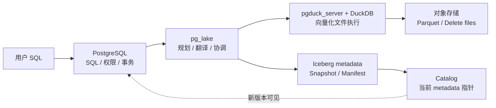

这张图中最容易混淆的四个角色是：

- **PostgreSQL** 决定 SQL 语义和事务是否成功；
- **DuckDB** 负责把大批量列式计算做快；
- **Iceberg** 定义一张表如何由许多不可变文件组成并随版本演化；
- **Catalog** 保存逻辑表名当前指向哪一份 Iceberg metadata。

pg_lake 的核心价值不是替代这四者，而是协调它们。

---

## 1. 最小知识地图

先不要背源码名。先掌握 9 个基础概念：

| 概念 | 小白解释 | 在 pg_lake 中为什么重要 |
|---|---|---|
| 数据库 | 一个能用 SQL 管数据的系统 | PostgreSQL 是用户看到的入口 |
| SQL | 让数据库查、写、改、删数据的语言 | 用户仍然写普通 SQL |
| 表 | 行和列组成的数据集合 | pg_lake 让数据湖文件看起来像表 |
| 事务 | 一组操作要么都成功，要么都失败 | 写文件、写元数据、更新 catalog 必须协调 |
| 文件格式 | 单个文件怎么存数据，比如 Parquet | DuckDB 负责高效读写这些文件 |
| 表格式 | 多个文件如何组成一张可演进的表 | Iceberg 负责 snapshot、manifest、delete file |
| Catalog | 表名到当前元数据文件的映射 | 没有它，外部引擎不知道哪份元数据是最新 |
| FDW | PostgreSQL 访问外部数据的插件接口 | pg_lake_table 用它把湖表接入 PostgreSQL 执行器 |
| Pushdown | 把计算推给更适合的引擎 | pg_lake 把大扫描推给 DuckDB，而不是让 PostgreSQL 一行行扫 |

再补充 8 个后文会反复出现的概念：

| 概念 | 小白解释 | 典型例子 |
|---|---|---|
| 对象存储 | 通过 key/path 保存对象的远端存储 | S3、GCS、Azure Blob、兼容 S3 的存储 |
| 不可变文件 | 写完以后通常不在原位置随机改行 | Parquet data file |
| Snapshot | 某一时刻完整的表状态 | 当前表版本、历史版本 |
| Manifest | 记录数据文件、删除文件和统计信息的清单 | 哪个文件属于哪个 snapshot |
| Position delete | 用“文件路径 + 行号”表示逻辑删除 | `(s3://.../a.parquet, 42)` |
| COW | Copy-on-Write，修改时重写数据文件 | 删除比例高时重写幸存行 |
| MOR | Merge-on-Read，写删除记录，读时合并 | 少量删除先写 position delete |
| Compaction | 把小文件和删除记录压实为干净大文件 | `VACUUM` 重写并清理旧文件 |

---

## 2. 为什么不是直接让 PostgreSQL 读 Parquet

只读几个 Parquet 文件，DuckDB 已经可以做；PostgreSQL 也可以通过扩展接入。但 pg_lake 的目标更大：**让一堆对象存储文件具备数据库表的语义。**

单独的 Parquet 只回答：

- 这个文件有哪些列？
- 列怎么压缩？
- 怎么只读某些列？

Iceberg 表格式额外回答：

- 当前这张表由哪些数据文件组成？
- 每次写入后产生了哪个新版本？
- 哪些旧版本还要保留给时间旅行或并发读？
- 哪些行被逻辑删除了？
- schema 或分区规则变了以后，老文件怎么继续可读？
- Spark、Trino、PyIceberg、DuckDB 等外部引擎怎么读同一张表？

因此：

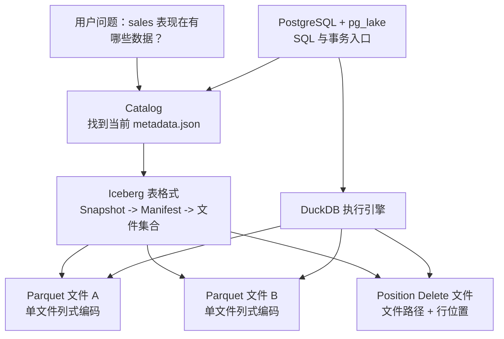

| 层次 | 它回答的问题 | pg_lake 中的代表 |
|---|---|---|
| 文件格式 | 一个物理文件的字节、列、压缩、统计如何组织？ | Parquet、CSV、JSON |
| 表格式 | 很多文件如何组成一张有版本、有删除、有演化的表？ | Apache Iceberg |
| Catalog | 当前哪一份表元数据是权威版本？怎样原子切换？ | 本地 Catalog、REST Catalog、object-store catalog |
| 执行引擎 | 谁真正扫描、过滤、连接、聚合和写文件？ | DuckDB |
| 数据库接入 | 用户如何用 SQL、事务和权限操作？ | PostgreSQL + pg_lake |

> **常见误区：** Parquet 不是一张完整的 Iceberg 表；Iceberg 也不是查询引擎；Catalog 更不是保存全部业务数据的数据库。

---

## 3. 整体架构：三层分工

pg_lake 的核心不是把所有能力塞进 PostgreSQL，而是拆成三层。

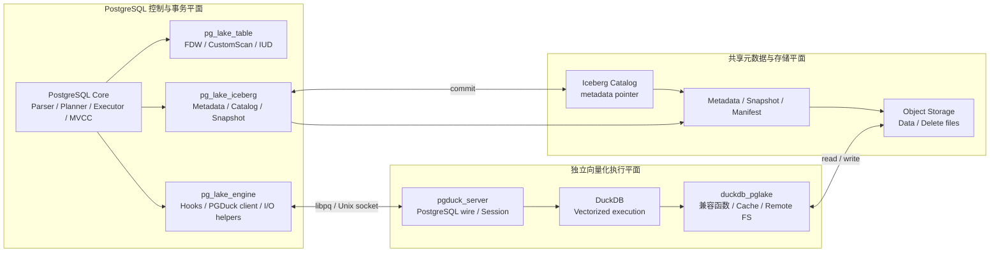

| 层 | 主要组件 | 责任 |
|---|---|---|
| SQL 与事务层 | PostgreSQL、`pg_lake_table`、`pg_lake_iceberg`、`pg_lake_engine` | 接收 SQL、规划查询、维护本地目录、协调事务、提交 Iceberg 元数据 |
| 向量化执行层 | `pgduck_server`、DuckDB、`duckdb_pglake` | 高速扫描文件、写 Parquet、处理对象存储、缓存、类型兼容 |
| 表格式与存储层 | Iceberg metadata、manifest、data file、delete file、对象存储 | 保存真正的数据文件和跨引擎可读的表状态 |

### 3.1 用户看到的是 PostgreSQL

用户连接 PostgreSQL，不直接连接 DuckDB：

```sql
SELECT * FROM lake_table WHERE dt = DATE '2026-06-26';
INSERT INTO lake_table VALUES (...);
DELETE FROM lake_table WHERE id = 100;
```

PostgreSQL 仍然负责：

- SQL 入口；
- 权限；
- 事务边界；
- planner/executor；
- 不适合下推时的本地回退执行。

### 3.2 DuckDB 负责“重活”

大数据分析通常要扫描大量列式文件。DuckDB 擅长：

- `read_parquet(...)`；
- filter/projection pushdown；
- Parquet/CSV/JSON 读写；
- 对象存储访问；
- 向量化执行。

pg_lake 不把 DuckDB 直接嵌进 PostgreSQL 后端进程，而是通过 `pgduck_server` 隔离出来。这样可以降低线程模型、内存模型、崩溃影响等风险，代价是多了一层 libpq/PostgreSQL wire 协议边界。

### 3.3 Iceberg 负责“表的正确性和互操作”

Iceberg 不执行 SQL，它保存表状态：

- metadata JSON；
- snapshot；
- manifest list；
- manifest；
- data file；
- position delete file；
- schema/partition evolution；
- catalog pointer。

如果没有 Iceberg，pg_lake 仍可扫文件，但会失去标准湖表语义、跨引擎互操作、版本管理和删除语义。

---

## 4. SELECT 查询从头到尾怎么走

假设用户执行：

```sql
SELECT name, amount
FROM sales
WHERE dt = DATE '2026-06-26' AND amount > 100;
```

先看全链路，再逐步拆解：

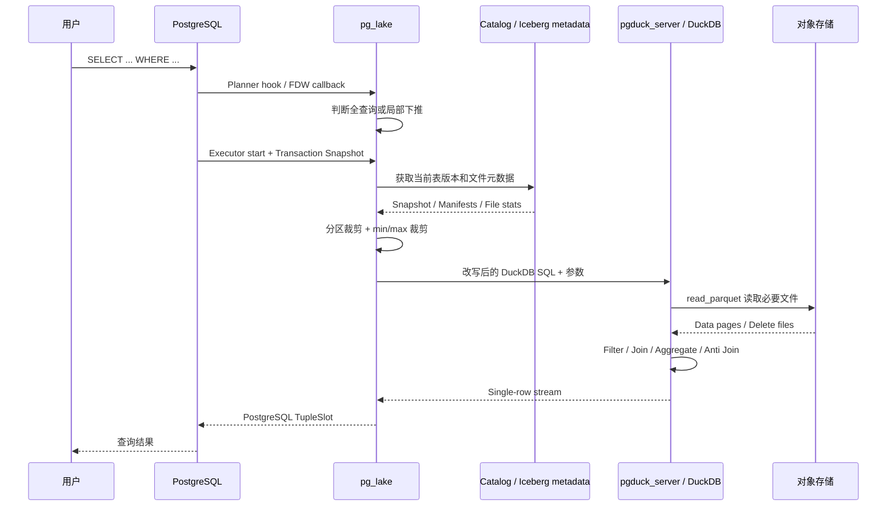

### 第 1 步：PostgreSQL 解析 SQL

PostgreSQL 先把 SQL 解析成内部语法树，然后 planner 开始找执行方案。pg_lake 通过 FDW callback 和 planner hook 参与这个过程。

### 第 2 步：判断能不能下推

pg_lake 会判断：

- 查询是不是只涉及 lake 表；
- 表达式 DuckDB 是否支持；
- 函数、类型、操作符语义是否可安全映射；
- 是否需要 PostgreSQL 本地处理一部分逻辑。

结果有两种：

| 情况 | 执行方式 |
|---|---|
| 整个查询都能下推 | 走 CustomScan，全查询推给 DuckDB |
| 只能部分下推 | 走 ForeignScan，DuckDB 做文件扫描，PostgreSQL 处理剩余逻辑 |

全查询下推通常需要同时满足：

- 命令类型和游标模式受支持；
- 查询涉及的关系满足 lake table 条件；
- 函数、操作符、类型和表达式能在 DuckDB 中保持兼容语义；
- 没有必须留在 PostgreSQL 执行的节点；
- 对应 GUC 已启用。

如果不满足，并不等于查询失败。pg_lake 可以只下推扫描、过滤、连接或上层聚合的一部分，让 PostgreSQL 执行剩余逻辑。

### 第 3 步：在执行开始时创建 scan snapshot

pg_lake 不在规划阶段就固定文件列表，而是在 executor start 时基于当前事务快照创建扫描快照。这样能让查询看到事务内一致的表状态。

原因是规划和执行之间可能存在时间差。如果规划时就把对象存储文件列表写死：

- 另一个事务可能已经提交新 snapshot；
- 当前事务内可能刚写入或删除文件；
- Prepared Statement 可能被多次执行；
- 参数值在执行时才确定，影响文件裁剪。

因此 pg_lake 在执行开始时创建 `PgLakeScanSnapshot`，把事务快照、参数、关系限制条件和文件视图绑定在一起。

### 第 4 步：发现文件并裁剪文件

pg_lake 找出这张表当前 snapshot 下的数据文件，再根据 WHERE 条件做文件裁剪：

- 分区值不可能匹配的文件跳过；
- min/max 统计不可能匹配的文件跳过；
- `_filename` 谓词可裁剪路径；
- position delete 需要参与读时过滤。

这一步非常关键，因为对象存储里可能有成千上万个文件。少读一个文件，就少一次 I/O。

文件裁剪是分层进行的：

1. **路径和分区裁剪**：例如只查询 `dt = 2026-06-26`，可以跳过其他日期分区；
2. **列统计裁剪**：如果文件的 `amount.max = 80`，它不可能满足 `amount > 100`；
3. **字段 ID 映射**：Schema 演化后不能只依赖列位置，要用 Iceberg field ID 对齐；
4. **谓词证明**：利用 PostgreSQL 的谓词蕴含/反驳逻辑判断文件是否必然不匹配；
5. **删除文件关联**：只有与候选 data file 相关的 position delete 才需要参与读取。

### 第 5 步：生成 DuckDB SQL

pg_lake 把 lake 表访问改写成类似：

```sql
SELECT name, amount
FROM read_parquet([...], filename=true, file_row_number=true)
WHERE dt = DATE '2026-06-26' AND amount > 100;
```

如果有 position delete，还会加 anti-join 逻辑，大意是：

```sql
读取数据文件
  排除 delete file 中记录的 (文件路径, 行号)
```

更接近真实执行形态的伪 SQL：

```sql
SELECT wanted_columns
FROM read_parquet(
  [candidate_data_files],
  filename = true,
  file_row_number = true,
  schema = expected_iceberg_schema
) AS data
WHERE (data.filename, data.file_row_number) NOT IN (
  SELECT file_path, pos
  FROM read_parquet([related_position_delete_files])
);
```

只有存在删除文件，或 UPDATE/DELETE 需要构造行身份时，才有必要读取 `filename` 和 `file_row_number`；普通查询不会无条件支付这项成本。

### 第 6 步：pgduck_server 执行并流式返回

PostgreSQL backend 通过 libpq 连接 `pgduck_server`，发送改写后的 SQL。DuckDB 扫 Parquet 并返回文本行，pg_lake 再把文本转回 PostgreSQL tuple slot。

`pgduck_server` 是独立进程而不是嵌入 PostgreSQL backend，优点是隔离 DuckDB 的线程、内存和扩展运行环境；代价是查询参数和结果需要经过 PostgreSQL wire/libpq 边界，存在序列化与文本转换开销。

---

## 5. INSERT / UPDATE / DELETE 怎么走

传统 OLTP 数据库常常原地更新行。湖表通常不这么做，因为对象存储和 Parquet 更适合追加大文件，而不是随机改某一行。

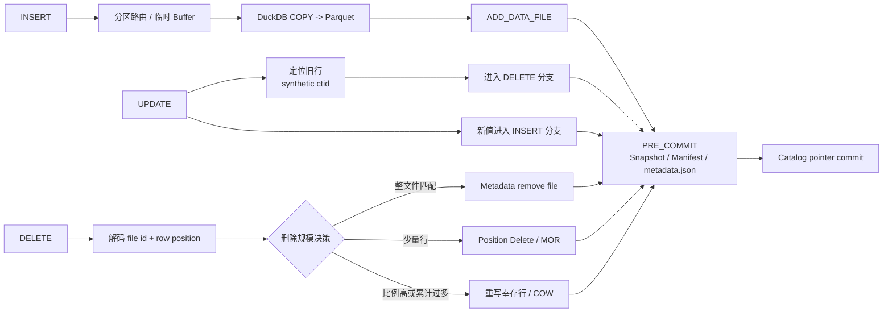

### 5.1 INSERT：写新数据文件

INSERT 的大意是：

```text
接收用户行
  -> 写入临时 staging
  -> DuckDB COPY 成 Parquet 数据文件
  -> pg_lake 记录新增 data file
  -> 提交时写入 Iceberg metadata
```

实现上通常不是每来一行就产生一个对象存储文件，而是：

1. PostgreSQL FDW 接收行；
2. 按 Iceberg 分区规则把行路由到不同 writer；
3. 先写入本地或 staging CSV buffer；
4. 达到目标大小后，让 DuckDB `COPY` 成 Parquet；
5. 收集文件大小、行数、列统计、分区值和 field ID；
6. 把 `ADD_DATA_FILE` 加入当前事务的 metadata change set；
7. PRE_COMMIT 时生成新的 Iceberg snapshot。

### 5.2 DELETE：不一定立刻重写大文件

删除一行时，pg_lake 需要知道这行来自哪个文件、文件内第几行。它使用隐藏的行身份：

```text
_pg_lake_filename + file_row_number -> 合成 ctid
```

这里的 `ctid` 不是传统 PostgreSQL Heap 页内地址，而是 pg_lake 合成的逻辑行身份。扫描阶段由 DuckDB 返回文件名和零基行号，pg_lake 编码成 PostgreSQL 能携带的 `ItemPointer`；执行 UPDATE/DELETE 时再解码回源文件和行位置。

然后有三种策略：

| 删除情况 | 策略 | 小白解释 |
|---|---|---|
| 整个文件都被删 | 只从元数据移除文件引用 | 不搬书，只改目录 |
| 删除少量行 | MOR，写 position delete | 不改原书，贴一张“这些页作废”的纸 |
| 删除很多行 | COW，重写数据文件 | 旧书太多页作废，直接重印一本干净的 |

### 5.3 UPDATE = DELETE + INSERT

湖表里 UPDATE 通常可以理解为：

```text
把旧行标记删除
  + 写入一行新数据
```

这就是为什么 UPDATE 路径同时涉及 delete file 和 insert data file。

两部分必须在同一张新 snapshot 中原子可见，否则可能出现：

- 旧行已经不可见，新行还没加入，造成短暂丢行；
- 新行已经可见，旧行还没删除，造成重复；
- 数据文件已写入，但 metadata commit 失败，形成孤儿文件。

### 5.4 MOR 为什么快，为什么又需要 VACUUM

MOR（Merge-On-Read）快在写入端：删除少量行时只写小 delete file，不重写大 Parquet 文件。

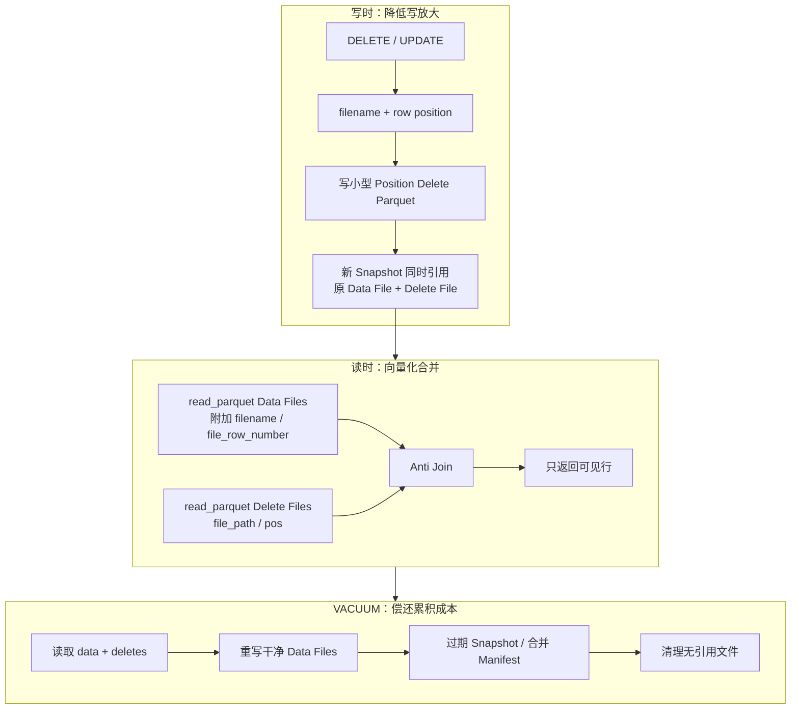

但读的时候要额外应用 delete file，所以 delete file 积累多了会拖慢查询。VACUUM/compaction 的作用就是：

- 合并小文件；
- 把 delete file 吸收到重写后的数据文件里；
- 过期旧 snapshot；
- 清理不再引用的对象存储文件；
- 合并 manifest。

### 5.5 pg_lake 如何在 MOR 和 COW 之间选择

当前实现的主要判断包括：

| 条件 | 倾向策略 | 原因 |
|---|---|---|
| 整个 data file 都满足删除条件 | Metadata remove | 不需要生成 delete file，也不需要读取幸存行 |
| 单文件只有少量行被删 | MOR | 写小 delete file 比重写大 Parquet 便宜 |
| 单文件删除比例达到阈值 | COW | 继续保留大量 delete positions 会拖慢查询 |
| 全表累计 position-deleted rows 过多 | COW/Compaction | 防止删除债务无限增长 |
| `VACUUM` 选择文件压实 | COW rewrite | 将读时合并成本重新物化为干净数据文件 |

当前默认 `copy_on_write_threshold` 约为 20%，设置为 `0` 可强制 COW，设置为 `100` 可强制 MOR。全表累计删除行的默认上限约为 10,000,000，`-1` 表示禁用该上限。

这些是 pg_lake 策略，不是 Iceberg 规范强制值。生产配置需要根据文件大小、更新比例、读写比、查询延迟目标和 VACUUM 周期压测。

---

## 6. Catalog 到底是什么

Iceberg 每次提交都会生成新的 metadata JSON。问题是：**读者怎么知道哪一个 metadata JSON 是当前最新版本？**

Catalog 就是这个答案。

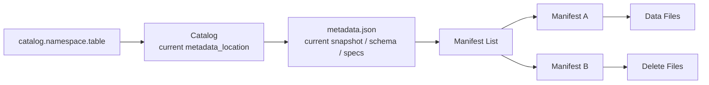

Catalog 至少要提供：

- 表名到 metadata-location 的映射；
- 原子提交能力；
- 表创建、删除、更新；
- 可选的 REST Catalog 协议互操作。

pg_lake 里同时有几类 catalog 相关能力：

| 能力 | 说明 |
|---|---|
| PostgreSQL 本地 catalog | `lake_iceberg.tables_internal`、`tables_external`、`pg_catalog.iceberg_tables` |
| REST Catalog 桥接 | 对接外部 Iceberg REST Catalog |
| Object-store catalog | 把指针导出为对象存储中的 catalog JSON |
| 元数据检查函数 | `metadata`、`files`、`snapshots`、`data_file_stats` |
| 事务 hook | 在 PRE_COMMIT/COMMIT/ABORT 时协调元数据变更 |

### 6.1 为什么对象存储里的“最新文件”不能替代 Catalog

对象存储中可能同时存在：

- 当前版本 metadata；
- 历史版本 metadata；
- 写到一半但提交失败的 metadata；
- 并发 writer 生成的候选 metadata；
- 已不再引用但尚未过期清理的文件。

因此不能靠文件名排序或最后修改时间猜当前版本。Catalog 必须提供权威 pointer。

### 6.2 Catalog 如何处理并发提交

Iceberg 使用乐观提交思路：

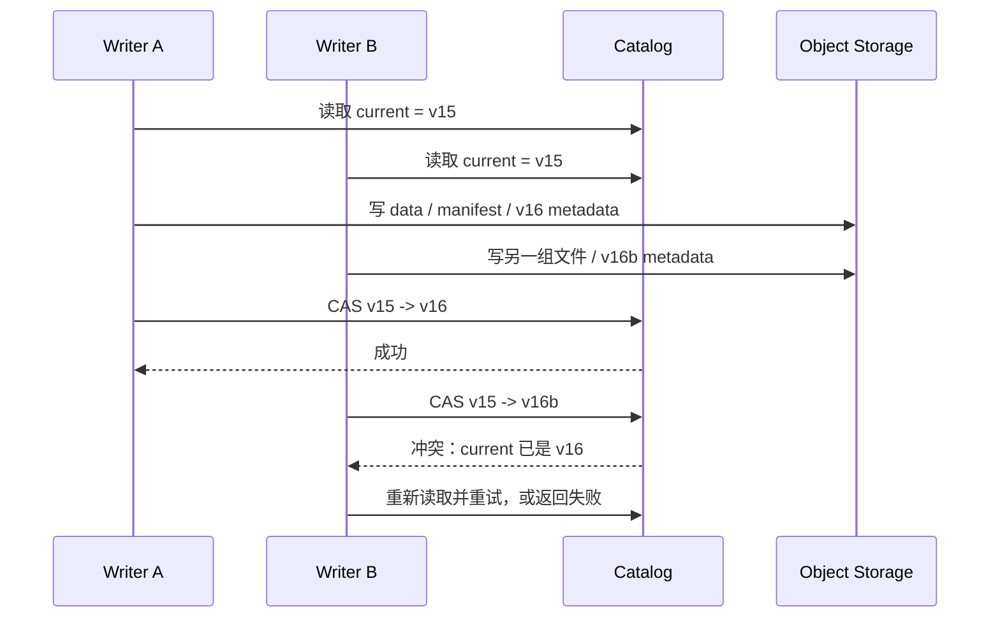

关键顺序是：

1. 读取基线 metadata；
2. 写新的不可变数据和元数据文件；
3. 最后比较并原子切换 current pointer；
4. 如果基线已经变化，则冲突，而不是覆盖别人提交。

### 6.3 pg_lake 实际承担的 Catalog 能力

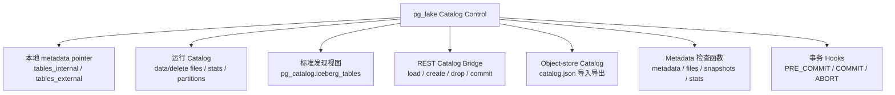

| 能力 | pg_lake 做什么 | 为什么需要 |
|---|---|---|
| 内部 metadata pointer | 保存当前和前一 metadata location | PostgreSQL 内部表要有权威版本入口 |
| 文件运行目录 | 保存 data/delete 文件、统计、分区、field ID、row ID 映射 | 支持事务内扫描、裁剪和写入决策 |
| `iceberg_tables` 视图 | 统一暴露内部和外部表 | 便于外部生态发现 pg_lake 表 |
| REST Catalog | 解析 endpoint/OAuth/credentials，加载和提交外部表 | 接入标准 Catalog 服务 |
| Object-store Catalog | 导出和读取轻量 `catalog.json` | 无完整 REST 服务时提供简单发现 |
| 检查函数 | 暴露 metadata、files、snapshots、stats | 调试、验证和运维 |
| XACT Hook | 追踪事务内操作，PRE_COMMIT 生成 metadata，ABORT 清状态 | 将 PostgreSQL 事务与 Iceberg 提交串联 |

### 6.4 Catalog 和 PostgreSQL 事务不是同一个东西

PostgreSQL Catalog 行更新可以参与本地 WAL/MVCC 事务，但对象存储写文件和外部 REST 请求不属于同一个物理原子事务。典型风险包括：

- Parquet 已上传，PostgreSQL 事务却 ABORT；
- 新 metadata 已写，Catalog pointer 更新失败；
- 本地事务提交成功，REST Catalog 请求失败或超时；
- 客户端看到超时，但服务端其实已成功提交；
- crash 后遗留 staging 或孤儿文件。

这也是为什么 pg_lake 需要 deletion queue、orphan retention、重试、可观测性和 VACUUM，而不能只依赖 PostgreSQL rollback。

---

## 6A. Iceberg 能力边界：用了什么、不提供什么

### 6A.1 pg_lake 使用的 Iceberg 能力

| Iceberg 能力 | pg_lake 中的用途 |
|---|---|
| v2 metadata JSON | 保存当前 schema、partition spec、snapshot 和 metadata log |
| Snapshot / Snapshot log | 表示提交后的逻辑表版本和历史状态 |
| Manifest List / Manifest | 发现 data/delete 文件并利用分区摘要和列统计规划扫描 |
| Field ID | Schema 演化后稳定对齐字段，而不是依赖列位置 |
| Partition spec / transform | 隐藏分区、分区裁剪和 partition evolution |
| Position delete | 以 `(file_path, pos)` 表达 MOR 行级删除 |
| Data file metrics | 利用 lower/upper bound、row count 等信息裁剪文件 |
| Catalog metadata pointer | 原子发布新的当前表版本 |
| REST Catalog protocol | 对接外部 Catalog 和可写外部表 |
| Snapshot/Manifest maintenance | snapshot expire、manifest merge、compaction 基础 |

### 6A.2 Iceberg 不提供的能力

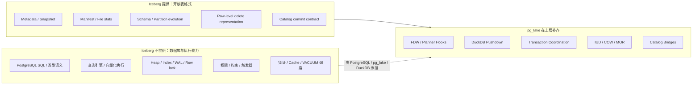

Iceberg 不解析 PostgreSQL DDL/DML，不执行 SQL，不维护 B-tree，不提供行锁，也不会自动决定 pg_lake 的 COW/MOR 阈值。

### 6A.3 如果没有 Iceberg

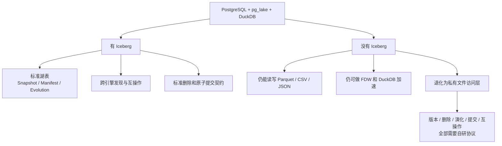

没有 Iceberg 时仍然保留：

- PostgreSQL SQL 入口；
- FDW 和 planner hook；
- DuckDB 文件扫描和写入；
- Parquet/CSV/JSON 的导入导出；
- 对象存储访问。

但会失去：

- 标准 snapshot 和 manifest；
- 标准 schema/partition evolution；
- 标准 row-level delete 表达；
- 标准 metadata pointer commit；
- 时间旅行和回滚的元数据基础；
- Spark、Trino、Flink、PyIceberg 等生态契约。

结论不是“没有 Iceberg 就不能工作”，而是系统会从 lakehouse table 退化为自定义 file access layer。

---

## 7. pg_lake 和普通 OLTP 数据库有什么不同

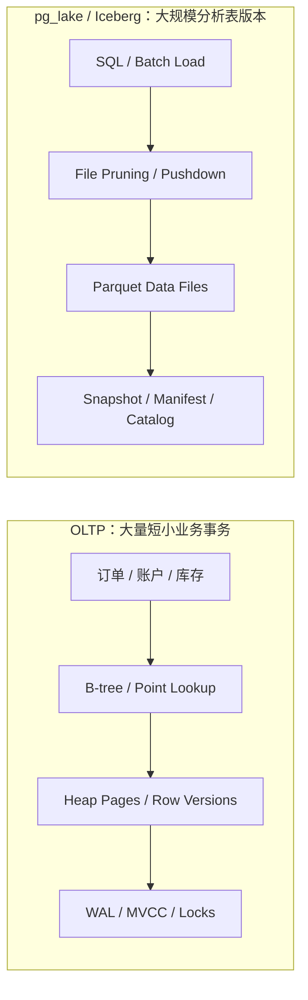

| 维度 | pg_lake/Iceberg | 普通 OLTP 数据库 |
|---|---|---|
| 核心目标 | 大规模分析、对象存储、跨引擎互操作 | 高频小事务、点查、在线业务 |
| 存储方式 | 不可变数据文件 + 元数据提交 | 行存储页、索引、WAL、MVCC |
| 更新方式 | delete file 或重写文件 | 原地版本链/行级修改 |
| 查询优势 | 列式扫描、文件裁剪、批量分析 | 索引点查、低延迟事务 |
| 并发写 | 更偏表级/元数据级协调 | 行锁、页级/行级 MVCC |
| 维护任务 | compaction、snapshot expire、manifest merge | vacuum、checkpoint、索引维护 |

所以不要把 pg_lake 当成“OLTP 替代品”。它的价值是把 PostgreSQL SQL 体验带到 lakehouse 分析场景。

更直观的选择方式：

| 业务问题 | 优先选择 |
|---|---|
| 用户登录后按主键读取一条账户记录 | OLTP |
| 每秒并发修改大量订单状态 | OLTP |
| 扫描一年日志并按地区聚合 | pg_lake/Iceberg |
| 保存 PB 级事实表并给 Spark/Trino/PostgreSQL 共享 | pg_lake/Iceberg |
| 热业务数据需要分析 | OLTP 保存当前状态，通过 ETL/CDC 进入 Lakehouse |

即使 pg_lake 接入 PostgreSQL 事务，也不意味着对象存储里的 Parquet 获得了 Heap page、WAL、B-tree 和行锁的物理特性。

---

## 8. Iceberg 和 Lance 怎么比

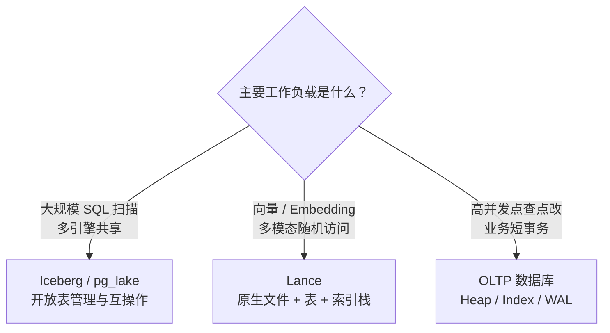

| 维度 | Iceberg | Lance |
|---|---|---|
| 主要定位 | 通用 lakehouse 表格式 | AI/ML 向量和多模态数据格式 |
| 文件生态 | Parquet/ORC/Avro 等 | Lance 原生格式 |
| 核心能力 | snapshot、manifest、catalog、schema/partition evolution、delete file | 向量检索、fragment、row lineage、嵌入数据管理 |
| 生态互操作 | Spark、Flink、Trino、PyIceberg 等 | LanceDB 和 AI 数据栈 |
| 对 pg_lake/GaussDB 的启发 | 更适合作为通用分析湖表基线 | 适合作为向量/AI 工作负载补充评估 |

需要注意：

- Iceberg 主要定义开放表格式，底层数据常使用 Parquet/ORC/Avro；
- Lance 同时覆盖原生文件格式、表格式和索引格式，技术栈更偏 AI 数据；
- Iceberg 强项是多计算引擎互操作和超大分析表管理；
- Lance 强项是随机访问、向量索引、Embedding 和多模态训练数据；
- 两者都不应被直接理解成高并发 OLTP 存储引擎。

---

## 8A. 正确性、性能与运维的边界

### 8A.1 一次写入跨越哪些故障域

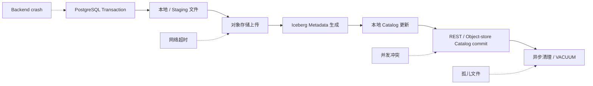

| 故障点 | 可能结果 | 需要的工程能力 |
|---|---|---|
| DuckDB 写文件失败 | 当前写入无法形成 data file | 错误传播、临时文件清理 |
| 对象存储上传部分成功 | 已有对象但事务未提交 | orphan retention、删除队列 |
| Metadata 写成功，pointer commit 失败 | 候选 metadata 不可见 | 重试、冲突检测、后续清理 |
| REST 请求超时 | 不确定远端是否已提交 | 幂等请求、查询确认、可观测性 |
| PostgreSQL ABORT | 本地变更回滚，远端文件可能仍在 | ABORT hook、垃圾文件回收 |
| Snapshot 长期积累 | 规划变慢、存储膨胀 | snapshot expire、manifest merge |
| Position delete 长期积累 | SELECT 反连接成本上升 | COW 阈值、VACUUM/compaction |

### 8A.2 性能主要来自哪里

性能收益不是只靠“用了 DuckDB”，而是多个环节共同作用：

1. **列裁剪**：只读查询需要的 Parquet 列；
2. **分区裁剪**：按 Iceberg partition values 跳过文件；
3. **统计裁剪**：按 lower/upper bound 跳过不可能匹配的文件；
4. **全查询下推**：减少 PostgreSQL 与 DuckDB 之间的数据传输；
5. **向量化执行**：批量处理 filter/join/aggregate；
6. **并行文件操作**：并行上传和远端文件处理；
7. **本地缓存**：减少重复对象存储读取；
8. **合理文件大小**：避免过多小文件和过大单文件；
9. **及时 compaction**：控制 delete files 和 manifests 数量。

### 8A.3 最重要的观测指标

- 查询最终是 CustomScan、ForeignScan 还是本地执行；
- 规划前文件数、裁剪后文件数和裁剪原因；
- 对象存储 GET/PUT/DELETE 次数、字节量、延迟和重试；
- pgduck_server 查询时间、排队、内存和取消；
- 每张表 data/delete 文件数与平均文件大小；
- position-deleted rows 和 COW/MOR 选择；
- Snapshot、Manifest 数量及过期速度；
- Metadata commit、REST Catalog 请求和冲突次数；
- 孤儿文件、删除队列和清理滞后。

---

## 9. 对 GaussDB 评估最关键的问题

如果要把类似 pg_lake 的能力放到 GaussDB 里，优先评估这些问题：

1. GaussDB 有没有等价的 FDW、planner hook、executor hook 或 table access method 接入点？
2. DuckDB 应该外置、内嵌，还是替换成自研/现有向量化执行引擎？
3. 本地 catalog 和 Iceberg metadata 如何保持一致？
4. COMMIT、ABORT、crash recovery、REST catalog 失败时怎么恢复？
5. 写并发采用表级串行化，还是实现 Iceberg 乐观并发重试？
6. 对象存储凭证放在哪里，谁能访问执行服务？
7. 类型语义怎么对齐：时间、decimal、数组、JSON、geometry、collation、NaN/Infinity？
8. 如何做兼容性测试：Spark、Trino、PyIceberg、DuckDB 是否都能读？
9. VACUUM/compaction/snapshot expire 是否是一等能力，而不是后期补丁？
10. 如何观测和定位跨 PostgreSQL/GaussDB、执行引擎、对象存储、catalog 的问题？

建议把评估拆成五个工作包：

| 工作包 | 首要产出 |
|---|---|
| 扩展接入 | planner/executor/transaction hook 能力清单与原型 |
| 执行引擎 | 外置、内嵌、自研三种方案的性能与故障隔离对比 |
| 元数据与 Catalog | 本地状态、Iceberg metadata、REST commit 的一致性协议 |
| 写入与维护 | IUD、MOR/COW、Compaction、Snapshot expire 的策略 |
| 兼容性与运维 | 类型矩阵、Spark/Trino/PyIceberg 互操作、指标和故障演练 |

---

## 10. 从 0 到源码的学习路线

建议按这个顺序读，避免一上来陷进源码细节。

### 第 1 天：只理解大图

- 数据库、SQL、表、事务；
- Parquet 是文件格式；
- Iceberg 是表格式；
- DuckDB 是执行引擎；
- pg_lake 是 PostgreSQL 到 lakehouse 的桥。

验收问题：

- 为什么 Parquet 不等于 Iceberg？
- 为什么用户连 PostgreSQL，而不是直接连 DuckDB？
- Catalog 为什么需要原子提交？

### 第 2 天：理解 SELECT

- PostgreSQL planner；
- FDW 与 CustomScan；
- 文件发现；
- 分区裁剪和统计裁剪；
- DuckDB `read_parquet`；
- position delete 读时过滤。

验收问题：

- 为什么 pg_lake 要延迟到 executor start 绑定文件？
- 什么情况下不能全查询下推？
- delete file 为什么会影响 SELECT？

### 第 3 天：理解写入和删除

- INSERT 写 data file；
- DELETE 写 position delete 或移除 data file；
- UPDATE = DELETE + INSERT；
- COW/MOR 权衡；
- VACUUM/compaction。

验收问题：

- MOR 写入为什么快？
- MOR 读多了为什么会变慢？
- COW 什么时候更划算？

### 第 4 天：理解提交和 Catalog

- PostgreSQL 事务 hook；
- PRE_COMMIT 生成 metadata；
- COMMIT 发送 REST catalog 请求；
- ABORT 清理；
- object-store catalog；
- 失败恢复风险。

验收问题：

- metadata JSON、manifest、snapshot 各自是什么？
- REST catalog 失败为什么危险？
- 本地 catalog 和 Iceberg metadata 为什么可能不一致？

### 第 5 天：开始读源码

优先读这些文件：

- `D:/pg_lake/pg_lake_iceberg/pg_lake_iceberg--3.0.sql`
- `D:/pg_lake/pg_lake_iceberg/pg_lake_iceberg--3.3--3.4.sql`
- `D:/pg_lake/pg_lake_iceberg/src/iceberg/catalog.c`
- `D:/pg_lake/pg_lake_iceberg/src/iceberg/metadata_operations.c`
- `D:/pg_lake/pg_lake_iceberg/src/rest_catalog/rest_catalog.c`
- `D:/pg_lake/pg_lake_iceberg/src/object_store_catalog/object_store_catalog.c`
- `D:/pg_lake/pg_lake_iceberg/src/iceberg/external_metadata_modification.c`
- `D:/pg_lake/pg_lake_iceberg/src/init.c`
- `D:/pg_lake/pg_lake_engine/include/pg_lake/util/catalog_type.h`
- `D:/pg_lake/pg_lake_engine/src/utils/catalog_type.c`
- `D:/pg_lake/pg_lake_table/src/transaction/transaction_hooks.c`
- `D:/pg_lake/pg_lake_table/src/transaction/track_iceberg_metadata_changes.c`
- `D:/pg_lake/docs/iceberg-tables.md`
- `D:/pg_lake/pg_lake_iceberg/tests/pytests/test_iceberg_functions.py`
- `D:/pg_lake/pg_lake_table/tests/pytests/test_object_store_catalog.py`
- `D:/pg_lake/pg_lake_table/tests/pytests/test_polaris_catalog.py`
- `D:/pg_lake/pg_lake_table/tests/pytests/test_polaris_catalog_writable.py`
- `D:/pg_lake/pg_lake_table/tests/pytests/test_modify_iceberg_rest_table.py`
- `D:/pg_lake/pg_lake_table/tests/pytests/test_iceberg_catalog_server.py`
- `D:/pg_lake/README.md`
- `D:/pg_lake/pg_lake_table/pg_lake_table--3.0.sql`
- `D:/pg_lake/pg_lake_table/src/fdw/writable_table.c`
- `D:/pg_lake/pg_lake_engine/src/pgduck/read_data.c`
- `D:/pg_lake/pg_lake_engine/src/pgduck/write_data.c`
- `D:/pg_lake/pg_lake_iceberg/include/pg_lake/iceberg/api/datafile.h`
- `D:/pg_lake/docs/file-formats-reference.md`
- `D:/pg_lake/docs/dbt.md`
- `D:/pg_lake/pg_lake_iceberg/pg_lake_iceberg--3.0--3.1.sql`
- `D:/pg_lake/pg_lake_iceberg/src/iceberg/read_table_metadata.c`
- `D:/pg_lake/pg_lake_iceberg/src/iceberg/read_manifest.c`
- `D:/pg_lake/pg_lake_iceberg/src/iceberg/api/table_metadata.c`
- `D:/pg_lake/pg_lake_table/src/fdw/snapshot.c`
- `D:/pg_lake/pg_lake_table/src/fdw/data_file_pruning.c`
- `D:/pg_lake/pg_lake_table/src/fdw/position_delete_dest.c`
- `D:/pg_lake/pg_lake_table/src/ddl/ddl_changes.c`
- `D:/pg_lake/pg_lake_iceberg/tests/pytests/test_iceberg_metadata_via_spark.py`

---

## 11. 关键源码导航

| 想理解什么 | 优先看哪里 |
|---|---|
| 扩展加载和 GUC | `pg_lake_engine/src/init.c`、`pg_lake_table/src/init.c`、`pg_lake_iceberg/src/init.c` |
| FDW 扫描和写入 | `pg_lake_table/src/fdw/pg_lake_table.c` |
| SELECT 快照和文件发现 | `pg_lake_table/src/fdw/snapshot.c` |
| 文件裁剪 | `pg_lake_table/src/fdw/data_file_pruning.c` |
| IUD 与 COW/MOR | `pg_lake_table/src/fdw/writable_table.c` |
| position delete 写入 | `pg_lake_table/src/fdw/position_delete_dest.c` |
| 全查询下推 | `pg_lake_table/src/planner/query_pushdown.c` |
| 事务 hook | `pg_lake_table/src/transaction/transaction_hooks.c` |
| Iceberg 元数据提交 | `pg_lake_iceberg/src/iceberg/metadata_operations.c` |
| REST Catalog | `pg_lake_iceberg/src/rest_catalog/rest_catalog.c` |
| pgduck 客户端 | `pg_lake_engine/src/pgduck/client.c` |
| DuckDB 读写 SQL 生成 | `pg_lake_engine/src/pgduck/read_data.c`、`write_data.c`、`delete_data.c` |
| pgduck_server | `pgduck_server/src/main.c`、`pgduck_server/src/pgsession/pgsession.c`、`pgduck_server/src/duckdb/duckdb.c` |
| DuckDB 扩展与对象存储 | `duckdb_pglake/src/duckdb_pglake_extension.cpp`、`duckdb_pglake/src/fs/functions.cpp` |

---

## 12. 外部官方资料

- <https://iceberg.apache.org/spec/>
- <https://iceberg.apache.org/spec/#optimistic-concurrency>
- <https://iceberg.apache.org/spec/#table-metadata>
- <https://iceberg.apache.org/spec/#metastore-tables>
- <https://iceberg.apache.org/rest-catalog-spec/>
- <https://raw.githubusercontent.com/apache/iceberg/main/open-api/rest-catalog-open-api.yaml>
- <https://parquet.apache.org/docs/file-format/>
- <https://www.postgresql.org/docs/current/transaction-iso.html>
- <https://www.postgresql.org/docs/current/mvcc.html>
- <https://lance.org/format/>
- <https://lance.org/format/file/>
- <https://lance.org/format/table/>
- <https://iceberg.apache.org/docs/latest/>
- <https://iceberg.apache.org/docs/latest/evolution/>
- <https://www.postgresql.org/docs/current/fdw-callbacks.html>
- <https://www.postgresql.org/docs/current/custom-scan.html>
- <https://github.com/apache/iceberg/blob/main/open-api/rest-catalog-open-api.yaml>
- <https://duckdb.org/docs/current/data/parquet/overview>
- <https://duckdb.org/docs/current/core_extensions/httpfs/s3api>
- <https://duckdb.org/docs/current/configuration/secrets_manager>

额外建议优先读：

- PostgreSQL FDW callback：<https://www.postgresql.org/docs/current/fdwhandler.html>
- PostgreSQL Custom Scan：<https://www.postgresql.org/docs/current/custom-scan.html>
- Apache Iceberg Spec：<https://iceberg.apache.org/spec/>
- Apache Iceberg REST Catalog：<https://iceberg.apache.org/rest-catalog-spec/>
- DuckDB Parquet：<https://duckdb.org/docs/current/data/parquet/overview.html>

---

## 13. 一页复盘

pg_lake 做的是一件“缝合但有清晰边界”的事：

- PostgreSQL 负责用户入口、SQL 语义、事务和权限；
- pg_lake 扩展负责把 SQL、文件、Iceberg 元数据和事务串起来；
- DuckDB 负责高性能文件扫描和写入；
- Iceberg 负责标准湖表元数据；
- 对象存储负责持久化数据文件和元数据文件；
- Catalog 负责告诉所有引擎当前表版本在哪里。

这套系统最大的收益是：用户可以用 PostgreSQL 体验操作 lakehouse 数据，外部引擎也能通过 Iceberg 读取同一张表。

最大的复杂度是：提交时必须同时考虑本地 catalog、对象存储文件、Iceberg metadata、REST/object-store catalog、事务成功/失败和后续清理。

### 最后用 12 句话自测

1. Parquet 是单文件格式，Iceberg 是多文件表格式。
2. Iceberg 不执行 SQL，DuckDB 才是文件计算引擎。
3. Catalog 不保存全部行数据，它保存并提交当前 metadata pointer。
4. PostgreSQL 是用户入口和事务协调者。
5. pg_lake_table 通过 FDW/CustomScan 接入规划和执行。
6. pg_lake_engine 提供公共 Hook、PGDuck 客户端和文件读写辅助。
7. pg_lake_iceberg 负责 Iceberg metadata、Catalog 和维护语义。
8. SELECT 在 executor start 才绑定事务一致的文件视图。
9. UPDATE 可以理解为 DELETE 旧行加 INSERT 新行。
10. MOR 写入快，是因为少量删除只写 position delete；读时需要合并。
11. COW 和 VACUUM 用重写换取更低的后续读取成本。
12. pg_lake/Iceberg 面向分析湖仓，不是 OLTP 行存储的直接替代。

### 常见问题

**Q：只要用了 Iceberg，就自动支持高性能查询吗？**

A：不是。Iceberg 提供文件规划所需元数据；性能仍取决于执行引擎、下推、裁剪、文件布局、缓存和对象存储。

**Q：Catalog 挂了，能不能直接扫描对象存储恢复？**

A：可以做灾难恢复工具，但正常读写不能靠猜最新 metadata。必须恢复权威 pointer 和并发提交语义。

**Q：MOR 是否永远比 COW 快？**

A：不是。MOR 降低小修改的写放大，但 delete files 多时会增加读取和规划成本。

**Q：为什么要保留 PostgreSQL 本地 Catalog？**

A：内部表的事务扫描、文件裁剪、写入决策和 field/row mapping 需要事务内可见的运行状态。

**Q：为什么还要 pgduck_server，不能直接在 PostgreSQL 进程里调用 DuckDB？**

A：外置进程能隔离线程、内存、扩展和崩溃，但会付出协议和序列化开销。这是明确的工程取舍。

**Q：什么场景应优先考虑 Lance？**

A：向量索引、Embedding、多模态训练样本和低延迟随机访问是核心需求时，应单独评估 Lance。
